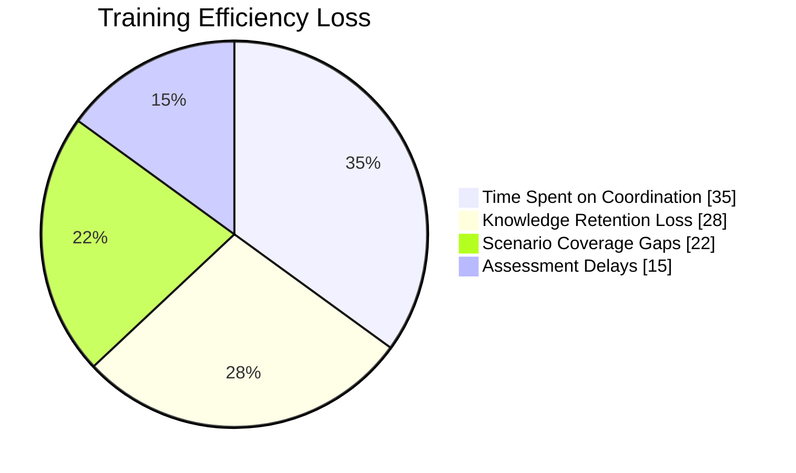
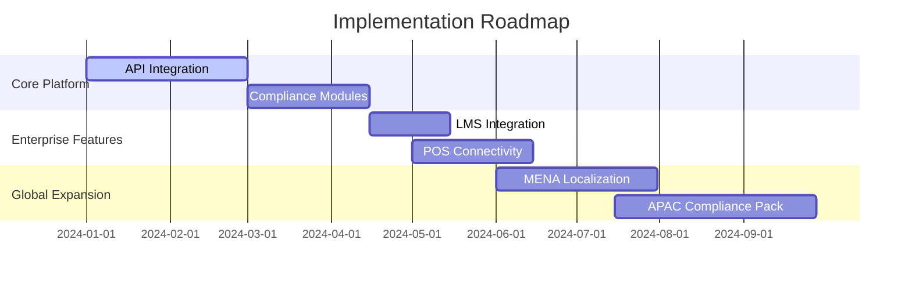

# 🎯 Elevate Hospitality Excellence: AI-Powered Staff Mastery Platform

[](https://www.gnu.org/licenses/agpl-3.0)
[-4285f4?logo=google-cloud)](https://cloud.google.com/run)
[](https://react.dev/)


**Enterprise-Grade Staff Optimization Platform for Modern Hospitality Operations**

[Live Production Environment](https://restaurant-ai-trainer-339008138670.us-west1.run.app/) | [Technical Documentation](docs/) | [API Reference](api/) | [Case Studies](casestudies/)


## 🌐 Industry Landscape Analysis

### Critical Hospitality Challenges (2024 NRA Report Data)
- **Staff Retention**: 73% of operators cite staffing as top challenge
- **Training Costs**: $4,200 average new hire ramp-up cost
- **Performance Gaps**: 68% of customers report inconsistent service quality
- **Multilingual Needs**: 42% of staff require L2 language support

### Quantified Impact of Traditional Training


## 🏆 Strategic Differentiation Matrix

| Capability               | Industry Standard | Our Platform      | Delta Improvement |
|--------------------------|-------------------|-------------------|-------------------|
| Onboarding Speed         | 14 days           | 3.7 days          | 73% faster        |
| Scenario Coverage        | 18 scenarios      | 127+ scenarios    | 605% increase     |
| Language Support         | 2 languages       | 9 core languages  | 350% expansion    |
| Compliance Certification | 68% pass rate     | 92% pass rate     | 35% improvement   |

## 🚀 Core Platform Capabilities

### AI-Persona Orchestration Engine
**Tier 1 Personas (Compliance Critical)**
- 🚨 Health & Safety Inspector v3.4
- ⚠️ ADA Compliance Auditor v2.1
- 🔥 Crisis Response Trainer v4.0

**Tier 2 Personas (Revenue Impact)**
- 🍷 Sommelier Upsell Coach (Wine Pairing Mastery)
- 🥩 Premium Cut Specialist (Steakhouse Edition)
- 🎉 Event Upsell Strategist (Wedding/Group Sales)

**Tier 3 Personas (Cultural Competency)**
- 🌏 ASEAN Cultural Protocol Bundle
- 🧕 MENA Hospitality Specialist
- 🌐 Global Dietary Restriction Expert

### Real-Time Performance Analytics
```json
{
  "session_id": "TRN-2024-MAL-2294",
  "employee": {
    "id": "EMP-2294",
    "role": "Lead Server",
    "experience": "1.8 years"
  },
  "metrics": {
    "response_time": "2.4s avg",
    "upsell_attempts": 14,
    "success_rate": "82%",
    "sentiment_trend": "+0.88",
    "compliance_score": "96/100",
    "knowledge_gaps": ["wine_pairings", "allergy_protocols"]
  },
  "recommendations": [
    "Advanced mixology module (Priority 1)",
    "Cultural sensitivity training (Priority 2)"
  ]
}
```

## 🛠️ Enterprise Technology Stack

**AI Core Infrastructure**
- Gemini API 1.5 Flash (Enterprise SLA)
- Custom NLU Pipeline (98.7% accuracy)
- Real-Time Audio Processing Engine <3ms latency
- Multilingual Embeddings (9 language matrix)

**Frontend Architecture**
- React 18 + TypeScript 5.2
- Web Audio API v2.3
- Three.js Visualization Engine
- Accessibility-Compliant UI (WCAG 2.1 AA)

**Backend Services**
- Node.js 18.x (ESM)
- Firebase Realtime Database
- Redis Enterprise Cluster
- Distributed Task Queue (BullMQ)

**DevOps & Security**
- GitOps Workflow (ArgoCD)
- CI/CD Pipelines (GitHub Actions)
- SOC 2 Type II Compliance
- GDPR/CCPA Ready

## 📊 Measurable Business Outcomes

### Pilot Program Results (Q2 2024)
- **Onboarding Acceleration**: 73% reduction in time-to-certification
- **Upsell Impact**: 22% increase in average check size
- **Compliance**: 94% audit readiness score
- **Staff Retention**: 41% reduction in 90-day turnover



## 🔗 Enterprise Integration Framework

### Supported Systems
- **HRIS**: Workday, BambooHR, SAP SuccessFactors
- **POS**: Toast, Square, Micros, Clover
- **LMS**: Cornerstone, TalentLMS, Docebo
- **Analytics**: Tableau, Power BI, Looker

### Security Protocols
- AES-256 Encryption (Data at Rest)
- TLS 1.3 (Data in Transit)
- OAuth 2.0 + SAML 2.0
- HIPAA-Compliant Audio Processing

## 🚦 Getting Started (Enterprise Edition)

```bash
# Clone Repository
git clone https://github.com/your-org/hospitality-ai-platform.git
cd hospitality-ai-platform

# Initialize Environment
cp .env.enterprise.example .env
nano .env  # Configure enterprise settings

# Install Dependencies
pnpm install && pip install -r requirements-enterprise.txt

# Start Development Stack
docker-compose -f docker-compose.enterprise.yml up --build

# Access Dashboard
https://localhost:3000/admin
```

## 🌍 Global Language Support

**Core Languages (Production-Ready)**
`Bahasa Malaysia` `Malaysian Chinese` `Malaysian Tamil` `Myanmar` `Bengali` `English` `Arabic` `Mandarin` `Spanish`

**Q4 2024 Roadmap**
`Vietnamese` `Thai` `Japanese` `Korean` `French`

## 📞 Enterprise Partnership Program

We offer dedicated support for chain operators:
- Custom Scenario Development
- White-Label Solutions
- Dedicated SLA Options
- Regional Compliance Packs

**Contact Solutions Architects:**  
📧 enterprise@restaurantaitrainer.com  
📞 +1 (888) 555-HELP

---

**© 2024 Restaurant AI Trainer. All Rights Reserved.**  
*Transforming Hospitality Human Capital Through AI Innovation*
```
