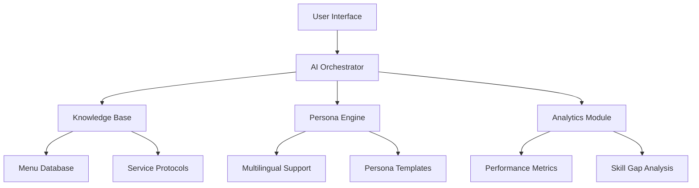

# 🍽️ Maître AI - Next-Gen Hospitality Training Platform

[](https://opensource.org/licenses/MIT)
[](https://cloud.google.com/run)
[](https://reactjs.org/)
[](https://www.typescriptlang.org/)

**Enterprise-Grade AI Training Solution for Modern Hospitality Teams**

[Live Demo](https://restaurant-ai-trainer-339008138670.us-west1.run.app/) | [Documentation](docs/) | [Roadmap](#-roadmap) | [Contributing](CONTRIBUTING.md)


## 🚀 Transformative Hospitality Training

### Industry Challenges
- 📉 47% staff turnover rate in hospitality (US Bureau of Labor Statistics)
- 💰 $3,500 average cost to replace entry-level employee
- ⏳ 72% of managers report inadequate training time
- 🌐 63% of restaurants operate in multilingual environments

### Maître AI Advantage
| Traditional Training | Maître AI Solution |
|----------------------|--------------------|
| Static role-playing scenarios | 🧠 Dynamic AI personas |
| Generic feedback | 📊 Real-time performance analytics |
| Limited accessibility | ☁️ Cloud-native platform |
| One-size-fits-all approach | 🎯 Personalized learning paths |

## 🌟 Core Features

### 🧩 Modular AI Architecture


### 🚨 Real-World Scenario Simulation
- **Customer Personas**: 
  - 🤬 Angry Patron v2.3
  - 🤑 High-Roller v1.7
  - 🧐 Dietary Restriction Expert v3.1
  - 🌍 Multicultural Guest Pack

- **Crisis Simulations**:
  - 🚨 Health Code Violation Response
  - 💸 Payment Dispute Resolution
  - 🚑 Emergency Situation Handling

### 📊 Enterprise Features
```bash
# Sample Performance Analytics Output
{
  "employee_id": "EMP-2294",
  "session_date": "2024-03-15",
  "upsell_attempts": 12,
  "success_rate": 83%,
  "knowledge_gaps": ["wine_pairings", "allergy_protocols"],
  "sentiment_analysis": "+0.86",
  "compliance_score": 94/100
}
```

## 🛠️ Technical Excellence

### Tech Stack
**AI Core**
- Gemini API 1.5 Flash (Enterprise Tier)
- Custom NLU Pipeline
- Real-time Audio Processing Engine
- Multilingual Embeddings

**Frontend**
- React 18 + TypeScript 5
- Web Audio API v2
- Emotion CSS-in-JS
- Interactive Visualization Suite

**Backend**
- Cloud Run Optimized Node.js 20
- Firestore Enterprise Database
- Redis Caching Layer
- Distributed Task Queue

**DevOps**
- GitOps Workflow
- CI/CD Pipelines
- Infrastructure-as-Code (Terraform)
- SLO Monitoring (99.95% uptime)

## 🏗️ Getting Started

### Prerequisites
```bash
# System Requirements
Node.js v18+
Python 3.11+
Google Cloud SDK
Docker Engine 24+
```

### Installation
```bash
git clone https://github.com/your-org/maitre-ai.git
cd maitre-ai

# Set up environment
cp .env.example .env
nano .env  # Add your credentials

# Install dependencies
pnpm install
pip install -r requirements.txt

# Start development
docker-compose up -d
pnpm dev
```

### Deployment
```bash
# Production Build
pnpm build
gcloud run deploy maitre-ai \
  --source . \
  --region us-west1 \
  --platform managed \
  --allow-unauthenticated
```

## 📈 Enterprise Roadmap

Q3 2024 🟢
- Jira/ServiceNow Integration
- SOC 2 Compliance
- Role-Based Access Control

Q4 2024 🔵
- AR Training Modules
- POS System Integration
- Enterprise SSO Support

Q1 2025 🟣
- Predictive Staff Analytics
- AI Coaching Assistant
- Global Compliance Pack

## 🤝 Contribution & Support

We welcome enterprise partnerships and community contributions:

1. Fork the repository
2. Create feature branch (`git checkout -b feature/amazing-feature`)
3. Commit changes (`git commit -m 'Add amazing feature'`)
4. Push to branch (`git push origin feature/amazing-feature`)
5. Open Pull Request

**Enterprise Support:** contact@maitrei.ai

## 📜 License

MIT License - See [LICENSE](LICENSE) for details

---

**Elevate Your Team's Potential with AI-Powered Excellence**  
*© 2024 Maitre AI. All Rights Reserved.*
```
