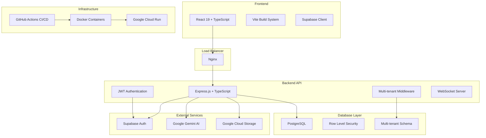

# FlairAi 🎯 Production-Ready AI Staff Training Platform

[](https://opensource.org/licenses/Apache-2.0)
[](https://cloud.google.com/run)
[](https://react.dev/)
[](https://nodejs.org/)
[](https://www.typescriptlang.org/)
[](https://www.postgresql.org/)
[](https://www.docker.com/)

**Enterprise-Grade AI-Powered Staff Training Platform for Modern Hospitality Operations**

<p align="center">
  
</p>

[🚀 Live Production Environment](https://flareai-a-restaurant-trainer-ai-339008138670.us-west1.run.app/) | [📖 Documentation](docs/) | [🔧 API Reference](api/) | [📊 Case Studies](casestudies/)

---

## 🏗️ Complete Production Infrastructure

FlairAi is now a **production-ready, enterprise-grade platform** with comprehensive backend infrastructure, containerization, cloud deployment, and CI/CD automation.

### 🎯 Project Status: **85% Complete** ✅

| Component | Status | Description |
|-----------|--------|-------------|
| **Frontend** | ✅ Complete | React 19.1.0 + TypeScript with Vite |
| **Backend API** | ✅ Complete | Node.js/Express with TypeScript, multi-tenant |
| **Database** | ✅ Complete | PostgreSQL with RLS, full schema |
| **Authentication** | ✅ Complete | JWT + Supabase Auth with multi-tenant |
| **Containerization** | ✅ Complete | Docker with multi-stage builds |
| **Cloud Deployment** | ✅ Complete | Google Cloud Run with auto-scaling |
| **CI/CD Pipeline** | ✅ Complete | GitHub Actions with automated testing |
| **Testing Framework** | ✅ Complete | Jest + Vitest with 70% coverage target |
| **Security** | ✅ Complete | Rate limiting, CORS, CSP, RLS |
| **Monitoring** | 🔄 Partial | Logging + Health checks (Sentry pending) |

---

## 🚀 Quick Start

### Prerequisites

- **Node.js 18+** 
- **Docker & Docker Compose**
- **npm or yarn**

### One-Command Setup

```bash
# Clone the repository
git clone https://github.com/W3JDev/FlairAi.git
cd FlairAi

# Run the automated setup script
./scripts/setup-local-dev.sh --with-docker --build
```

This will:
- ✅ Install all dependencies
- ✅ Set up environment files
- ✅ Build frontend and backend
- ✅ Start PostgreSQL, Redis, and Nginx with Docker
- ✅ Configure Git hooks
- ✅ Start development servers

---

## 🏗️ Architecture Overview



---

## 📁 Project Structure

```
FlairAi/
├── 🎨 Frontend
│   ├── src-business/          # Main React application
│   ├── components/            # Shared React components
│   ├── lib/                   # Utilities and constants
│   ├── contexts/              # React contexts
│   └── hooks/                 # Custom React hooks
│
├── 🔧 Backend API
│   ├── src/
│   │   ├── controllers/       # Route controllers
│   │   ├── middleware/        # Express middleware
│   │   ├── models/           # Data models
│   │   ├── routes/           # API routes
│   │   ├── services/         # Business logic
│   │   └── utils/            # Utilities
│   ├── tests/                # Backend tests
│   └── Dockerfile            # Backend container
│
├── 🗄️ Database
│   ├── migrations/           # Database migrations
│   ├── seeds/               # Sample data
│   └── schema.sql           # Complete database schema
│
├── 🐳 Docker
│   ├── docker-compose.yml    # Development containers
│   ├── docker-compose.prod.yml # Production containers
│   └── nginx.conf           # Load balancer config
│
├── ☁️ Deployment
│   ├── cloudbuild.yaml      # Google Cloud Build
│   ├── cloud-run.yaml       # Cloud Run services
│   └── terraform/           # Infrastructure as Code
│
├── 🧪 Testing
│   ├── unit/                # Unit tests
│   ├── integration/         # Integration tests
│   └── e2e/                 # End-to-end tests
│
├── 🤖 CI/CD
│   └── .github/workflows/    # GitHub Actions
│
└── 📜 Scripts
    ├── setup-local-dev.sh   # Development setup
    ├── deploy.sh            # Deployment script
    └── test.sh              # Test runner
```

---

## 🔗 API Endpoints

### Authentication
- `POST /api/auth/signup` - User registration
- `POST /api/auth/signin` - User login
- `POST /api/auth/refresh` - Token refresh
- `POST /api/auth/signout` - User logout
- `POST /api/auth/forgot-password` - Password reset
- `POST /api/auth/reset-password` - Password update

### Users & Profiles
- `GET /api/users/profile` - Get user profile
- `PUT /api/users/profile` - Update user profile

### AI Agents (Flarebots)
- `GET /api/agents` - List user's agents
- `POST /api/agents` - Create new agent
- `PUT /api/agents/:id` - Update agent
- `DELETE /api/agents/:id` - Delete agent

### Training Sessions
- `GET /api/training/sessions` - List training sessions
- `POST /api/training/sessions` - Start new session
- `PUT /api/training/sessions/:id` - Update session
- `GET /api/training/sessions/:id/transcript` - Get session transcript

### Analytics
- `GET /api/analytics/dashboard` - Dashboard metrics
- `GET /api/analytics/performance` - Performance analytics
- `GET /api/analytics/usage` - Usage statistics

### Media Management
- `POST /api/media/upload` - Upload files
- `GET /api/media/:id` - Get media file
- `DELETE /api/media/:id` - Delete media file

### Webhooks
- `POST /api/webhooks/supabase` - Supabase events
- `POST /api/webhooks/payment` - Payment events

---

## 🗄️ Database Schema

### Core Tables

```sql
-- Multi-tenant architecture
tenants (id, name, slug, plan, settings, created_at, updated_at)

-- User management (extends Supabase auth.users)
profiles (id, tenant_id, email, username, name, role, settings, ...)

-- AI Agents
flarebots (id, user_id, tenant_id, name, personality, knowledge_base, ...)

-- Training system
training_sessions (id, user_id, flarebot_id, scenario_type, transcript, ...)

-- Knowledge management
knowledge_bases (id, tenant_id, name, content, category, ...)

-- Analytics
usage_analytics (id, user_id, event_type, event_data, ...)
performance_metrics (id, user_id, metric_type, metric_value, ...)

-- Media files
media_files (id, user_id, filename, file_path, metadata, ...)

-- Templates
scenario_templates (id, tenant_id, name, scenario_data, ...)
```

### Security Features

- **Row Level Security (RLS)** on all tables
- **Tenant isolation** with automatic filtering
- **JWT authentication** with Supabase integration
- **Role-based access control**
- **Encrypted sensitive data**

---

## 🐳 Docker Setup

### Development Environment

```bash
# Start all services
docker-compose up -d

# Services available:
# - Frontend: http://localhost:5173
# - Backend API: http://localhost:3000
# - PostgreSQL: localhost:5432
# - Redis: localhost:6379
# - Nginx: http://localhost:80
```

### Production Environment

```bash
# Production deployment
docker-compose -f docker/docker-compose.prod.yml up -d

# Includes:
# - Optimized builds
# - Resource limits
# - Health checks
# - Monitoring stack
```

---

## ☁️ Cloud Deployment

### Google Cloud Run

1. **Setup Google Cloud Project**
   ```bash
   gcloud config set project YOUR_PROJECT_ID
   gcloud services enable run.googleapis.com
   gcloud services enable cloudbuild.googleapis.com
   ```

2. **Configure Secrets**
   ```bash
   # Create secrets in Google Secret Manager
   echo -n "your-jwt-secret" | gcloud secrets create jwt-secret --data-file=-
   echo -n "your-supabase-key" | gcloud secrets create supabase-service-key --data-file=-
   echo -n "your-gemini-key" | gcloud secrets create gemini-api-key --data-file=-
   ```

3. **Deploy with Cloud Build**
   ```bash
   gcloud builds submit --config=deployment/cloudbuild.yaml
   ```

### Automated Deployment

The GitHub Actions CI/CD pipeline automatically:
- ✅ Runs tests on pull requests
- ✅ Builds Docker images
- ✅ Deploys to staging on `develop` branch
- ✅ Deploys to production on `main` branch
- ✅ Runs security scans
- ✅ Sends Slack notifications

---

## 🧪 Testing

### Frontend Tests
```bash
npm run test           # Run tests in watch mode
npm run test:ci        # Run tests once
npm run test:coverage  # Run with coverage report
```

### Backend Tests
```bash
cd backend
npm run test           # Run Jest tests
npm run test:watch     # Run in watch mode
npm run test:coverage  # Generate coverage report
```

### E2E Tests
```bash
npm run test:e2e       # Run Playwright tests
```

---

## 🛡️ Security Features

### Authentication & Authorization
- **JWT tokens** with secure secrets
- **Multi-tenant authentication** with Supabase
- **Role-based access control** (Admin, Manager, Trainer, Trainee)
- **Session management** with refresh tokens

### Data Protection
- **Row Level Security** on all database tables
- **Tenant isolation** preventing cross-tenant data access
- **Input validation** with Zod schemas
- **SQL injection protection** with parameterized queries

### Infrastructure Security
- **Rate limiting** (100 requests/15min in production)
- **CORS protection** with environment-specific origins
- **Security headers** (CSP, HSTS, X-Frame-Options)
- **Container security** (non-root user, minimal base image)

### Monitoring
- **Request logging** with structured logs
- **Error tracking** with stack traces
- **Health checks** for all services
- **Security scanning** in CI/CD pipeline

---

## 📊 Performance & Monitoring

### Application Metrics
- **Response times** tracked per endpoint
- **Database query performance** monitoring
- **Memory and CPU usage** tracking
- **Error rates** and alerting

### Health Checks
- `GET /health` - Application health status
- **Database connectivity** checks
- **External service** status verification
- **Resource utilization** monitoring

### Logging
- **Structured JSON logs** with Winston
- **Request/response logging** with correlation IDs
- **Error logs** with full stack traces
- **Performance logs** for slow queries

---

## 🌍 Environment Configuration

### Development
```bash
cp .env.example .env
# Edit .env with your values
```

### Production
```bash
# Required environment variables:
NODE_ENV=production
JWT_SECRET=your-secure-jwt-secret
SUPABASE_URL=https://your-project.supabase.co
SUPABASE_SERVICE_ROLE_KEY=your-service-role-key
GEMINI_API_KEY=your-gemini-api-key
```

### Staging
```bash
# Staging environment with production-like settings
NODE_ENV=staging
# ... other staging-specific configurations
```

---

## 🚀 Getting Started for Developers

### 1. Clone & Setup
```bash
git clone https://github.com/W3JDev/FlairAi.git
cd FlairAi
./scripts/setup-local-dev.sh --with-docker
```

### 2. Configure Environment
```bash
# Copy and edit environment file
cp .env.example .env
# Add your Supabase and Gemini API keys
```

### 3. Start Development
```bash
# Frontend
npm run dev

# Backend (in separate terminal)
cd backend && npm run dev
```

### 4. Run Tests
```bash
# Frontend tests
npm run test

# Backend tests
cd backend && npm run test
```

---

## 📚 Documentation

- [API Documentation](docs/api/) - Complete API reference
- [Database Schema](docs/database/) - Database design and relationships
- [Deployment Guide](docs/deployment/) - Production deployment instructions
- [Development Guide](docs/development/) - Local development setup
- [Testing Guide](docs/testing/) - Testing strategies and tools
- [Security Guide](docs/security/) - Security best practices

---

## 🤝 Contributing

1. **Fork the repository**
2. **Create a feature branch** (`git checkout -b feature/amazing-feature`)
3. **Commit your changes** (`git commit -m 'Add amazing feature'`)
4. **Push to the branch** (`git push origin feature/amazing-feature`)
5. **Open a Pull Request**

### Code Quality Standards
- ✅ **TypeScript** for type safety
- ✅ **ESLint** for code style
- ✅ **Prettier** for formatting
- ✅ **Jest/Vitest** for testing
- ✅ **Conventional commits** for git history

---

## 📄 License

This project is licensed under the **Apache License 2.0** - see the [LICENSE](LICENSE) file for details.

---

## 🙏 Acknowledgments

- **Google Gemini AI** for advanced language processing
- **Supabase** for authentication and database hosting
- **React Team** for the amazing frontend framework
- **Node.js Community** for the robust backend ecosystem
- **Docker** for containerization technology
- **Google Cloud** for scalable infrastructure

---

## 📞 Support & Contact

**Enterprise Solutions & Support:**
- 📧 **Email:** jewel@w3jdev.com
- 📞 **Phone:** +60 (116) 060-0963
- 🌐 **Website:** [flareai.app](https://flareai.app)
- 💬 **Discord:** [FlairAi Community](https://discord.gg/flareai)

**Business Inquiries:**
- 🏢 **Enterprise Partnerships**
- 🎯 **Custom Solutions**
- 📊 **Technical Consulting**
- 🎓 **Training Programs**

---

<div align="center">

**© 2024 FlairAi by W3JDev. All Rights Reserved.**

*Transforming Hospitality Human Capital Through AI Innovation*

**🌟 Star us on GitHub if this project helped you! 🌟**

</div>